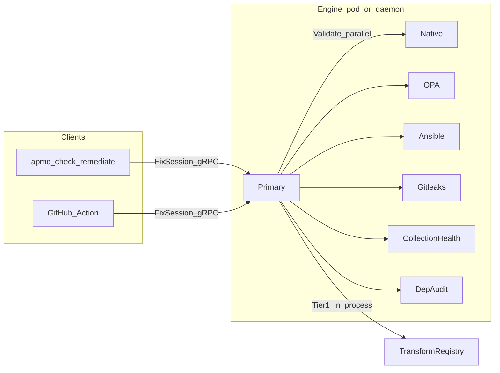

# Options discussion: third-party extensibility and overall tool use

This document is a **decision-support briefing** grounded in the current
repository. It complements [ADR-042: Third-Party Plugin Services](../../.sdlc/adrs/ADR-042-third-party-plugin-services.md), which remains **Proposed**; there is **no** `plugin.proto` or `APME_PLUGIN_*` integration in code yet.

---

## How the tool works today (what users actually touch)

**Primary user paths**

- **`apme check`** — Streams project files over **`FixSession`** to Primary; receives **remaining violations** (and patches only if the session applies fixes—the check path is primarily assessment). See [`src/apme_engine/cli/check.py`](../../src/apme_engine/cli/check.py).
- **`apme remediate`** — Same **`FixSession`** stream with **`FixOptions`** (passes, AI, etc.); Tier 1 fixes, optional proposals, writes back. See [`src/apme_engine/cli/remediate.py`](../../src/apme_engine/cli/remediate.py).
- **Hosted CI** — [`action.yml`](../../action.yml) installs the CLI and talks to a **`primary-address`**; no local pod in the workflow unless you bring one. Extensibility on the engine side **must exist on that hosted Primary** for CI to see it.

**What Primary does**

- Parses content, builds **hierarchy** (and related payloads), then **fan-out** to validators via `asyncio.gather()` — see [`_scan_pipeline`](../../src/apme_engine/daemon/primary_server.py).
- Validators implement **`Validator.Validate` + `Health` only** — [`proto/apme/v1/validate.proto`](../../proto/apme/v1/validate.proto). Built-in validators are **read-only** (ADR-009).
- **Tier 1 remediation** is **in-process**: [`partition.py`](../../src/apme_engine/remediation/partition.py) routes to **`TransformRegistry`** by `rule_id` (after `normalize_rule_id`). There is **no** `EXT-` or plugin routing today.

**Local daemon**

- [`launcher.py`](../../src/apme_engine/daemon/launcher.py) sets env vars (`NATIVE_GRPC_ADDRESS`, etc.) for known services. Plugins would need an analogous **discovery and startup** story for `apme daemon` / pod (ADR-042 sketches `APME_PLUGIN_<NAME>_ADDRESS`).

---

## Option 1: Implement ADR-042 as written (Plugin gRPC service)

**Idea:** One container per plugin: **`Validate` + `Transform` + `Describe` + `Health`**, `EXT-` rule IDs, env-based discovery, remediation routes `Transform` back to the owning plugin; Tier 2 AI **batched per plugin** with `metadata["ai_guidance"]`.

**Effect on tool use**

| Audience | Impact |
|----------|--------|
| **End users** | Same CLI; more findings possible from org plugins; **`EXT-...`** in output/SARIF/UI; remediate may apply **third-party** transforms (trust + review matter). |
| **Platform ops** | More containers, ports, env vars, health checks; hosted deployments must **register** plugin addresses on Primary. |
| **CI (hosted action)** | Plugins only run if the **remote Primary** is configured with them—**not** something the Action can turn on by itself without deployment support. |
| **Plugin authors** | Ship a container + (eventually) SDK; work off **`files` + `hierarchy_payload`**, not `scandata` (ADR-042 contract). |
| **Performance** | Validation fan-out stays parallel; **per-violation plugin `Transform`** is slower than in-proc Tier 1. |
| **Security / governance** | Clear isolation vs loading Python into Native; org accepts **write path** in plugin for remediate. |

**Dependency chain:** proto + SDK → Primary fan-out + Describe map → remediation routing → AI partitioning + `violation_convert` allowlist for `ai_guidance` (called out explicitly in ADR-042).

---

## Option 2: “Validation-only extensibility” without full ADR-042

**Idea:** Add only **custom detection** (e.g. another `Validator` implementation or a read-only sidecar) **without** a first-class plugin transform path.

**Effect on tool use**

- **`apme check`** and SARIF gain new rules if wired like other validators.
- **`apme remediate`** still only fixes **built-in** `TransformRegistry` (and AI tiers)—org-specific findings stay **manual or AI-only** unless you duplicate routing logic elsewhere.
- **Architectural tension:** [`AGENTS.md`](../../AGENTS.md) / ADR-042 narrative pushes **closed built-in bundles** and **plugins for custom policy**; a one-off “extra validator” without an ADR update risks drifting from that story.

Useful when the **only** goal is gates in CI, not automated fixes aligned with those gates.

---

## Option 3: No engine plugins — policy outside APME

**Idea:** Keep APME for Ansible-core compatibility + built-in catalog; enforce org naming/tags/compliance with **Ansible Lint custom rules**, **CI shell checks**, **OPA/conftest on YAML**, or **Gateway** policy if using enterprise UI.

**Effect on tool use**

- **Simpler ops** (single APME image/version).
- **Two tools / two reports** unless you merge results yourself; **no unified `FixSession`** convergence for org rules.
- Best when org policy changes often and teams already own another policy engine.

---

## Option 4: Contribute rules upstream to built-in validators

**Idea:** General-purpose rules land in Native/OPA/Ansible bundles; **no** third-party container.

**Effect on tool use**

- **Best UX** for everyone: one binary, one rule catalog, in-proc Tier 1 where transforms exist.
- **Slow / impossible** for proprietary org logic you cannot publish.

---

## Cross-cutting concerns (any plugin path)

1. **`partition.py` / Tier routing** — Today unknown IDs follow scope-based Tier 2/3 logic. Plugins need explicit rules: **Tier 1 = plugin `Transform` success**; failures → ADR-042’s **transform failed → AI candidate** behavior.
2. **Violation metadata** — SARIF, UI, and Gateway reporting should carry **origin** (`EXT-` prefix / plugin name) for attribution.
3. **Hierarchy JSON as public API** — ADR-042 flags **versioning** responsibility; breaking hierarchy shape breaks plugins silently or loudly depending on discipline.
4. **ADR status** — Treating ADR-042 as **Accepted** before implementation aligns SDLC with [`AGENTS.md`](../../AGENTS.md) invariants (built-in closed, plugins separate).

---

## Suggested conversation forks (for you to choose next)

- **Product:** “We need org gates in **hosted CI**” → stresses **deployment + Primary config**, not just SDK.
- **Product:** “We need **auto-fix** for our rules” → pushes toward **full ADR-042** (or upstream transforms).
- **Engineering:** “We want smallest slice” → **Phase 1** in ADR-042 (proto + SDK + example) **without** full remediate routing is a possible spike—but **end-to-end tool value** needs Phase 2–3.

Reply with your primary constraint (**CI vs local**, **check-only vs remediate**, **hosted vs pod**) to narrow a concrete recommendation or a scoped REQ/TASK set.
